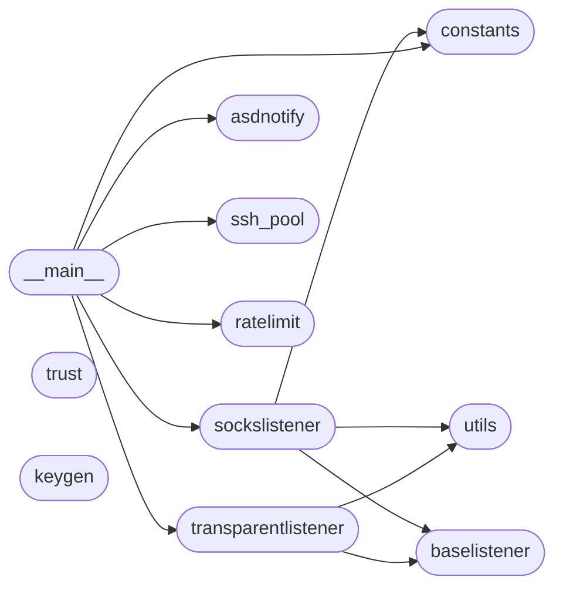

# Code Overview

[_Documentation generated by Documatic_](https://www.documatic.com)

<!---Documatic-section-Codebase Structure Python-start--->
## Codebase Structure Python

The codebase has a flat structure, with 12 code files.

<!---Documatic-block-system_architecture-start--->

<!---Documatic-block-system_architecture-end--->

# #
<!---Documatic-section-Codebase Structure Python-end--->

<!---Documatic-section-Important Functions-start--->
## Important Functions

<!---Documatic-block-important_funcs-start--->
<!---Documatic-block-most_used_funcs-start--->
### Most Utilised Functions

* [rsp.utils.detect_af](3-rsp_utils.md#rsp.utils.detect_af) (2 times)
<!---Documatic-block-most_used_funcs-end--->

<!---Documatic-block-end_user_funcs-start--->
### End User Exposed Functions

* [rsp.sockslistener.SocksListener](9-rsp_sockslistener.md#rsp.sockslistener.SocksListener)
* [rsp.constants.LogLevel](5-rsp_constants.md#rsp.constants.LogLevel)
* [rsp.asdnotify.AsyncSystemdNotifier](7-rsp_asdnotify.md#rsp.asdnotify.AsyncSystemdNotifier)
* [rsp.transparentlistener.TransparentListener](4-rsp_transparentlistener.md#rsp.transparentlistener.TransparentListener)
* [rsp.ratelimit.Ratelimit](10-rsp_ratelimit.md#rsp.ratelimit.Ratelimit)
* rsp.ssh_pool.SSHPool
* rsp.__main__.parse_args
* rsp.__main__.ssh_options_from_args
* rsp.__main__.amain
* rsp.__main__.main
<!---Documatic-block-end_user_funcs-end--->
<!---Documatic-block-important_funcs-end--->

# #
<!---Documatic-section-Important Functions-end--->

<!---Documatic-section-File IO-start--->
## File IO

<!---Documatic-block-file_io-start--->
The following files have file write operations

<!---Documatic-block-rsp-start--->

	
<code>rsp</code> (Click to Expand!)

* rsp.trust

<!---Documatic-block-rsp-end--->
<!---Documatic-block-file_io-end--->

# #
<!---Documatic-section-File IO-end--->

<!---Documatic-section-Class Hierarchy-start--->
## Class Hierarchy

<!---Documatic-block-ABC-start--->

	
<code>ABC</code> (Click to Expand!)

* rsp.baselistener.BaseListener

<!---Documatic-block-ABC-end--->

<!---Documatic-block-SocksException-start--->

	
<code>SocksException</code> (Click to Expand!)

* rsp.sockslistener.BadAddress
* rsp.sockslistener.BadAuthMethod
* rsp.sockslistener.BadVersion

<!---Documatic-block-SocksException-end--->

<!---Documatic-block-ctypes.Structure-start--->

	
<code>ctypes.Structure</code> (Click to Expand!)

* rsp.transparentlistener.sockaddr
* rsp.transparentlistener.sockaddr_in
* rsp.transparentlistener.sockaddr_in6

<!---Documatic-block-ctypes.Structure-end--->

<!---Documatic-block-enum.IntEnum-start--->

	
<code>enum.IntEnum</code> (Click to Expand!)

* [rsp.constants.LogLevel](5-rsp_constants.md#rsp.constants.LogLevel)

<!---Documatic-block-enum.IntEnum-end--->

<!---Documatic-block-queue.Queue-start--->

	
<code>queue.Queue</code> (Click to Expand!)

* rsp.utils.OverflowingQueue

<!---Documatic-block-queue.Queue-end--->

<!---Documatic-block-rsp.baselistener.BaseListener-start--->

	
<code>rsp.baselistener.BaseListener</code> (Click to Expand!)

* [rsp.sockslistener.SocksListener](9-rsp_sockslistener.md#rsp.sockslistener.SocksListener)
* [rsp.transparentlistener.TransparentListener](4-rsp_transparentlistener.md#rsp.transparentlistener.TransparentListener)

<!---Documatic-block-rsp.baselistener.BaseListener-end--->

# #
<!---Documatic-section-Class Hierarchy-end--->

[_Documentation generated by Documatic_](https://www.documatic.com)