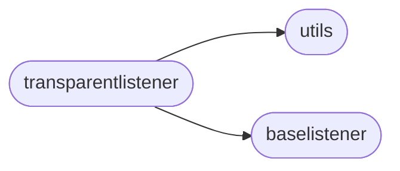

# Rsp Transparentlistener

[_Documentation generated by Documatic_](https://www.documatic.com)

<!---Documatic-section-Codebase Structure-start--->
## Codebase Structure

<!---Documatic-block-system_architecture-start--->

<!---Documatic-block-system_architecture-end--->

# #
<!---Documatic-section-Codebase Structure-end--->

<!---Documatic-section-rsp.transparentlistener.TransparentListener-start--->
## [rsp.transparentlistener.TransparentListener](4-rsp_transparentlistener.md#rsp.transparentlistener.TransparentListener)

<!---Documatic-section-TransparentListener-start--->
<!---Documatic-block-rsp.transparentlistener.TransparentListener-start--->
<details>
	<summary><code>rsp.transparentlistener.TransparentListener</code> code snippet</summary>

```python
class TransparentListener(BaseListener):

    def __init__(self, *, listen_address, listen_port, pool, timeout=4, loop=None):
        self._loop = loop if loop is not None else asyncio.get_event_loop()
        self._logger = logging.getLogger(self.__class__.__name__)
        self._listen_address = listen_address
        self._listen_port = listen_port
        self._children = set()
        self._server = None
        self._pool = pool
        self._timeout = timeout

    async def stop(self):
        self._server.close()
        await self._server.wait_closed()
        while self._children:
            children = list(self._children)
            self._children.clear()
            self._logger.debug('Cancelling %d client handlers...', len(children))
            for task in children:
                task.cancel()
            await asyncio.wait(children)
            await asyncio.sleep(0.5)

    async def _pump(self, writer, reader):
        while True:
            data = await reader.read(BUFSIZE)
            if not data:
                break
            writer.write(data)
            await writer.drain()

    async def handler(self, reader, writer):
        peer_addr = writer.transport.get_extra_info('peername')
        self._logger.info('Client %s connected', str(peer_addr))
        dst_writer = None
        try:
            sock = writer.transport.get_extra_info('socket')
            (dst_addr, dst_port) = get_orig_dst(sock)
            self._logger.info('Client %s requested connection to %s:%s', peer_addr, dst_addr, dst_port)
            async with self._pool.borrow() as ssh_conn:
                (dst_reader, dst_writer) = await asyncio.wait_for(ssh_conn.open_connection(dst_addr, dst_port), self._timeout)
                t1 = asyncio.ensure_future(self._pump(writer, dst_reader))
                t2 = asyncio.ensure_future(self._pump(dst_writer, reader))
                try:
                    await asyncio.gather(t1, t2)
                finally:
                    for t in (t1, t2):
                        if not t.done():
                            t.cancel()
                            while not t.done():
                                try:
                                    await t
                                except asyncio.CancelledError:
                                    pass
        except asyncio.CancelledError:
            raise
        except Exception as exc:
            self._logger.exception('Connection handler stopped with exception: %s', str(exc))
        finally:
            self._logger.info('Client %s disconnected', str(peer_addr))
            if dst_writer is not None:
                dst_writer.close()
            writer.close()

    async def start(self):

        def _spawn(reader, writer):

            def task_cb(task, fut):
                self._children.discard(task)
            task = self._loop.create_task(self.handler(reader, writer))
            self._children.add(task)
            task.add_done_callback(partial(task_cb, task))
        self._server = await asyncio.start_server(_spawn, self._listen_address, self._listen_port)
        self._logger.info('Transparent Proxy server listening on %s:%d', self._listen_address, self._listen_port)

    async def __aenter__(self):
        await self.start()
        return self

    async def __aexit__(self, exc_type, exc, tb):
        await self.stop()
```
</details>
<!---Documatic-block-rsp.transparentlistener.TransparentListener-end--->
<!---Documatic-section-TransparentListener-end--->

# #
<!---Documatic-section-rsp.transparentlistener.TransparentListener-end--->

[_Documentation generated by Documatic_](https://www.documatic.com)