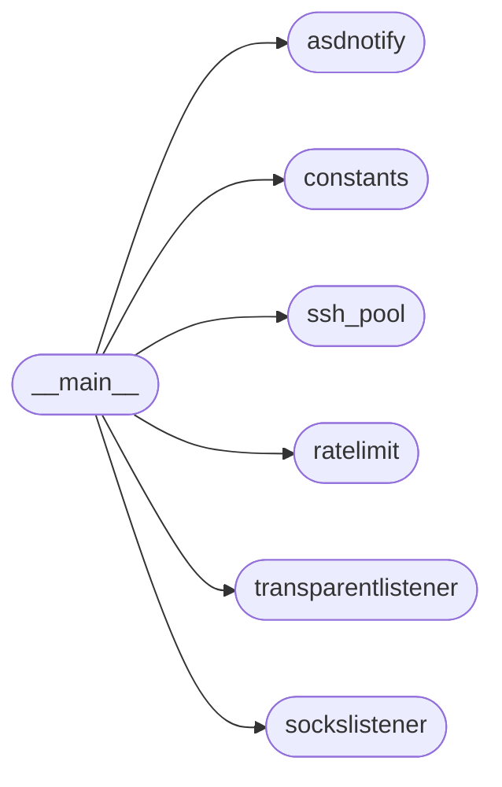
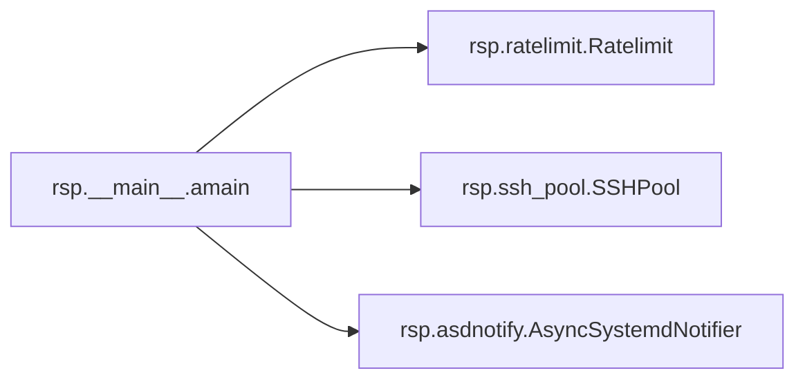
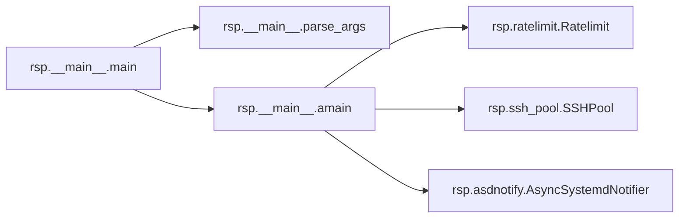

# Rsp Main

[_Documentation generated by Documatic_](https://www.documatic.com)

<!---Documatic-section-Codebase Structure-start--->
## Codebase Structure

<!---Documatic-block-system_architecture-start--->

<!---Documatic-block-system_architecture-end--->

# #
<!---Documatic-section-Codebase Structure-end--->

<!---Documatic-section-rsp.__main__.parse_args-start--->
## rsp.__main__.parse_args

<!---Documatic-section-parse_args-start--->
<!---Documatic-block-rsp.__main__.parse_args-start--->
<details>
	<summary><code>rsp.__main__.parse_args</code> code snippet</summary>

```python
def parse_args():
    parser = argparse.ArgumentParser(description='Rapid SSH Proxy', formatter_class=argparse.ArgumentDefaultsHelpFormatter)
    parser.add_argument('dst_address', help='target hostname')
    parser.add_argument('dst_port', nargs='?', default=22, type=utils.check_port, help='target port')
    parser.add_argument('-v', '--verbosity', help='logging verbosity', type=utils.check_loglevel, choices=LogLevel, default=LogLevel.info)
    parser.add_argument('-l', '--logfile', help='log file location', metavar='FILE')
    parser.add_argument('--disable-uvloop', help='do not use uvloop even if it is available', action='store_true')
    listen_group = parser.add_argument_group('listen options')
    listen_group.add_argument('-a', '--bind-address', default='127.0.0.1', help='bind address')
    listen_group.add_argument('-p', '--bind-port', default=1080, type=utils.check_port, help='bind port')
    listen_group.add_argument('-T', '--transparent', action='store_true', help='transparent mode')
    pool_group = parser.add_argument_group('pool options')
    pool_group.add_argument('-n', '--pool-size', default=30, type=utils.check_positive_int, help='target number of steady connections')
    pool_group.add_argument('-B', '--backoff', default=5, type=utils.check_positive_float, help='delay after connection attempt failure in seconds')
    pool_group.add_argument('-w', '--timeout', default=4, type=utils.check_positive_float, help='server connect timeout')
    pool_group.add_argument('-r', '--connect-rate', default=0.5, type=utils.check_nonnegative_float, help='limit for new pool connections per second')
    ssh_group = parser.add_argument_group('SSH options')
    ssh_group.add_argument('-L', '--login', help='SSH login. Default is name of current user')
    ssh_group.add_argument('-I', '--identity', action='append', help='SSH private key file. By default program looks for SSH keys in usual locations, including SSH agent socket. This option may be specified multiple times', metavar='KEY_FILE')
    ssh_group.add_argument('-P', '--password', help='SSH password. If not specified, password auth will be disabled')
    ssh_group.add_argument('-H', '--hosts-file', default=os.path.join(os.path.expanduser('~'), '.rsp', 'known_hosts'), help='overrides known_hosts file location', metavar='FILE')
    ssh_group.add_argument('--client-version', help='override client version string')
    return parser.parse_args()
```
</details>
<!---Documatic-block-rsp.__main__.parse_args-end--->
<!---Documatic-section-parse_args-end--->

# #
<!---Documatic-section-rsp.__main__.parse_args-end--->

<!---Documatic-section-rsp.__main__.ssh_options_from_args-start--->
## rsp.__main__.ssh_options_from_args

<!---Documatic-section-ssh_options_from_args-start--->
<!---Documatic-block-rsp.__main__.ssh_options_from_args-start--->
<details>
	<summary><code>rsp.__main__.ssh_options_from_args</code> code snippet</summary>

```python
def ssh_options_from_args(args, known_hosts):
    kw = dict()
    kw['gss_host'] = None
    kw['known_hosts'] = known_hosts
    if args.login is not None:
        kw['username'] = args.login
    if args.client_version is not None:
        kw['client_version'] = args.client_version
    if args.identity is not None:
        kw['client_keys'] = list(args.identity)
    if args.password is not None:
        kw['password'] = args.password
    return asyncssh.SSHClientConnectionOptions(**kw)
```
</details>
<!---Documatic-block-rsp.__main__.ssh_options_from_args-end--->
<!---Documatic-section-ssh_options_from_args-end--->

# #
<!---Documatic-section-rsp.__main__.ssh_options_from_args-end--->

<!---Documatic-section-rsp.__main__.amain-start--->
## rsp.__main__.amain

<!---Documatic-section-amain-start--->


### Object Calls

* [rsp.ratelimit.Ratelimit](10-rsp_ratelimit.md#rsp.ratelimit.Ratelimit)
* rsp.ssh_pool.SSHPool
* [rsp.asdnotify.AsyncSystemdNotifier](7-rsp_asdnotify.md#rsp.asdnotify.AsyncSystemdNotifier)

<!---Documatic-block-rsp.__main__.amain-start--->
<details>
	<summary><code>rsp.__main__.amain</code> code snippet</summary>

```python
async def amain(args, loop):
    logger = logging.getLogger('MAIN')
    try:
        known_hosts = asyncssh.read_known_hosts(args.hosts_file)
    except Exception as exc:
        logger.error('Host keys loading failed with error: %s', str(exc))
        (host_keys, ca_keys, x509_certs, x509_subjects) = ([], [], [], [])
    else:
        (host_keys, ca_keys, _, x509_certs, _, x509_subjects, _) = known_hosts.match(args.dst_address, '', args.dst_port)
    if not (host_keys or ca_keys or x509_certs or x509_subjects):
        logger.critical("Specified host is not found in known hosts. Please run following command: rsp-trust '%s' %d", args.dst_address, args.dst_port)
        return
    options = partial(ssh_options_from_args, args, known_hosts)
    ratelimit = Ratelimit(args.connect_rate)
    pool = SSHPool(dst_address=args.dst_address, dst_port=args.dst_port, ssh_options=options, timeout=args.timeout, backoff=args.backoff, ratelimit=ratelimit, size=args.pool_size, loop=loop)
    async with pool:
        logger.warning("SSH connection pool is starting up. Pool target: %d steady connections. It will take at least %.2f seconds to reach it's full size.", args.pool_size, args.pool_size * 1.0 / args.connect_rate)
        if args.transparent:
            from .transparentlistener import TransparentListener as Listener
        else:
            from .sockslistener import SocksListener as Listener
        server = Listener(listen_address=args.bind_address, listen_port=args.bind_port, timeout=args.timeout, pool=pool, loop=loop)
        async with server:
            logger.info('Server started.')
            exit_event = asyncio.Event()
            async with utils.Heartbeat():
                sig_handler = partial(utils.exit_handler, exit_event)
                signal.signal(signal.SIGTERM, sig_handler)
                signal.signal(signal.SIGINT, sig_handler)
                async with AsyncSystemdNotifier() as notifier:
                    await notifier.notify(b'READY=1')
                    await exit_event.wait()
                    logger.debug('Eventloop interrupted. Shutting down server...')
                    await notifier.notify(b'STOPPING=1')
```
</details>
<!---Documatic-block-rsp.__main__.amain-end--->
<!---Documatic-section-amain-end--->

# #
<!---Documatic-section-rsp.__main__.amain-end--->

<!---Documatic-section-rsp.__main__.main-start--->
## rsp.__main__.main

<!---Documatic-section-main-start--->


### Object Calls

* rsp.__main__.parse_args
* rsp.__main__.amain

<!---Documatic-block-rsp.__main__.main-start--->
<details>
	<summary><code>rsp.__main__.main</code> code snippet</summary>

```python
def main():
    args = parse_args()
    with utils.AsyncLoggingHandler(args.logfile) as log_handler:
        logger = utils.setup_logger('MAIN', args.verbosity, log_handler)
        utils.setup_logger('SocksListener', args.verbosity, log_handler)
        utils.setup_logger('TransparentListener', args.verbosity, log_handler)
        utils.setup_logger('SSHPool', args.verbosity, log_handler)
        logger.info('Starting eventloop...')
        if not args.disable_uvloop:
            if utils.enable_uvloop():
                logger.info('uvloop enabled.')
            else:
                logger.info('uvloop is not available. Falling back to built-in event loop.')
        loop = asyncio.get_event_loop()
        loop.run_until_complete(amain(args, loop))
        loop.close()
        logger.info('Server finished its work.')
```
</details>
<!---Documatic-block-rsp.__main__.main-end--->
<!---Documatic-section-main-end--->

# #
<!---Documatic-section-rsp.__main__.main-end--->

[_Documentation generated by Documatic_](https://www.documatic.com)